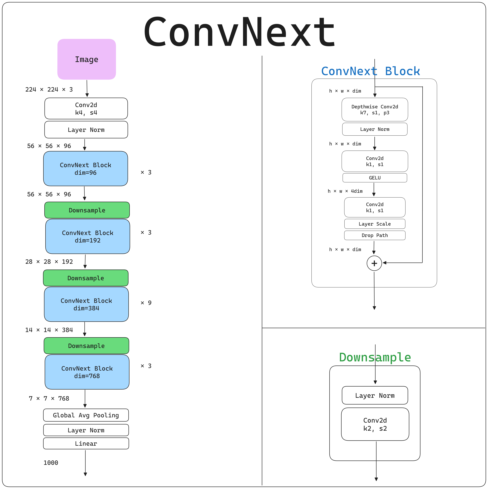
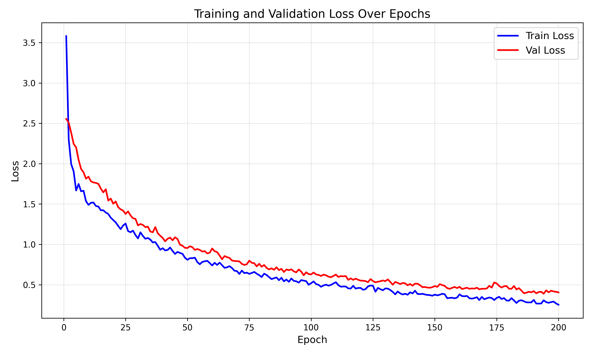
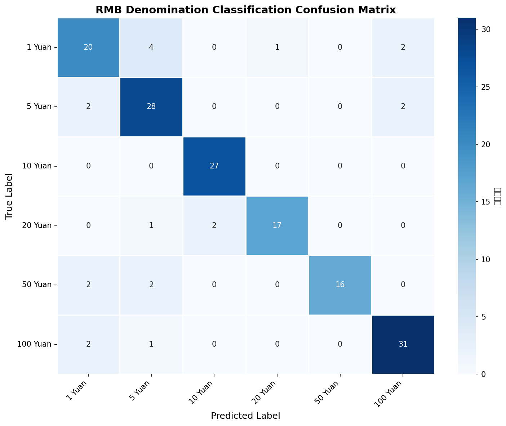

# RMB-identification-ConvNeXt


## 人民币面值识别ConvNeXt

基于 **ConvNeXt-Tiny** 实现的人民币面值识别项目，支持 PyTorch 原生推理和 ONNX Runtime 推理，可识别 `1` 元、`5` 元、`10` 元、`20` 元、`50` 元、`100` 元 **6** 种面值。


## 项目结构

```
├── assets/                 # 资源文件目录
│   └── ConvNeXt.png
├── inference/              # 测试图片目录
│   ├── 5yuan.jpg
│   ├── 5yuan.png
│   └── 100yuan.jpg
├── output/                 # 模型权重、ONNX文件及训练结果存放目录
├── RMBDataset/             # 数据集目录
├── infer_onnx.py           # ONNX Runtime 推理脚本
├── model.py                # ConvNeXt-Tiny 模型定义
├── split.py                # 数据集划分脚本
├── test.py                 # PyTorch 测试脚本
├── to_onnx.py              # ONNX 模型导出脚本
├── train.py                # 模型训练脚本
├── utils.py                # 工具函数: 损失曲线绘制
└── README.md               # 项目说明
```

## 模型简介

本项目选用的模型是 `ConvNeXt-tiny`，ConvNeXt 是 Facebook AI 提出的**纯卷积神经网络**（CNN）。

**模型结构如下**：



## 数据集简介

**链接**：[bat67/RMB-Dataset: 人民币照片数据集](https://github.com/bat67/RMB-Dataset)

|    项⽬    |                             说明                             |
| :--------: | :----------------------------------------------------------: |
| 数据集名称 |               RMB Dataset（人民币照片数据集）                |
|  数据体量  |                    约 30MB，轻量化易部署                     |
|  核心内容  | 包含不同场景下的人民币照片数据，覆盖人民币视觉分析的基础标注 / 原始数据 |
|  适用场景  | 人民币面额图像分类、纸币特征提取、视觉识别算法原型验证等入门级 CV 任务 |


本项目对该数据集的使用遵循原仓库的开源协议，数据集原始版权归 [bat67/RMB-Dataset](https://github.com/bat67/RMB-Dataset) 仓库维护者所有。

## 样本模型数据

### 训练损失图（Eopch = 200）



### 其他指标

- Best Epoch: 194
- TrainLoss: 0.3069
- ValLoss: 0.3880

**指标报告**：

```
 precision    recall  f1-score   support

           0       0.77      0.74      0.75        27
           1       0.78      0.88      0.82        32
           2       0.93      1.00      0.96        27
           3       0.94      0.85      0.89        20
           4       1.00      0.80      0.89        20
           5       0.89      0.91      0.90        34

    accuracy                           0.87       160
   macro avg       0.88      0.86      0.87       160
weighted avg       0.87      0.87      0.87       160

```

**混淆矩阵**：



## 使用方法
1. 数据集准备
- 将人民币面额图片按分类放入 `RMBDataset` 目录（如 `RMBDataset/1/`、`RMBDataset/5/`），或从[bat67/RMB-Dataset: 人民币照片数据集](https://github.com/bat67/RMB-Dataset)进行下载数据集。
- 运行脚本划分数据集：
  ```bash
  python split.py
  ```

2. 模型训练
```bash
python train.py
```
训练完成后，最优权重保存至 `./output/best_model.pth`。

3. 模型测试
```bash
python test.py
```

4. 导出ONNX模型
```bash
python to_onnx.py
```
模型保存至 `./output/convnext_tiny_rmb.onnx`。

5. ONNX推理
```bash
python infer_onnx.py
```

## 模型下载地址

通过网盘分享的文件：RMBConvNeXt-Model
链接: https://pan.baidu.com/s/1vSAPc-IiVdegLe5D5kWuIQ?pwd=1m2i 提取码: 1m2i
